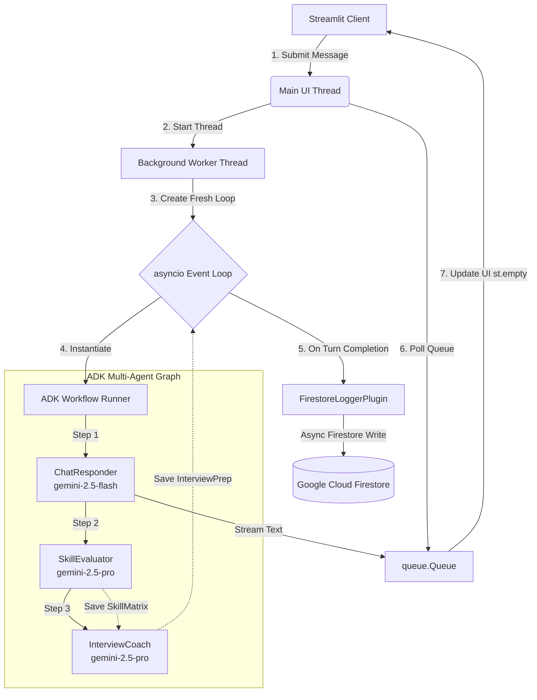

# VibeJournal - System Architecture & Design

VibeJournal is an enterprise-grade AI & Software Engineering mentoring application powered by a Google ADK 2.0 multi-agent workflow graph. The system audits users' technical gaps, provides tailored mock interview preparation, tracks metrics dynamically, and records history persistently.

---

## 🏗️ Architecture Overview

The system is split into three main layers:
1. **Presentation Layer (Streamlit Dashboard)**: A wide-layout UI providing a left-panel conversational mentor chat and a right-panel metrics progress and interview grading key accordion.
2. **Workflow Layer (ADK 2.0 Graph)**: An asynchronous workflow chaining together specialized generative agents (`gemini-2.5-flash` and `gemini-2.5-pro`).
3. **Storage & Telemetry Layer (Google Cloud Firestore & Vertex AI)**: Asynchronously logs query history, timestamps, and structured evaluation results to Cloud Firestore.



---

## 🤖 ADK Multi-Agent Graph Nodes

The workflow (`vibe_journal_workflow`) runs as a sequential chain:

```
[START] ──> ChatResponder ──> SkillEvaluator ──> InterviewCoach ──> [END]
```

| Node Name | Model | Schema Output | Role & Description |
|---|---|---|---|
| **`ChatResponder`** | `gemini-2.5-flash` | Plain Text | **SE Mentor**: Provides immediate, encouraging responses to the user prompt using the conversation context history. |
| **`SkillEvaluator`** | `gemini-2.5-pro` | `SkillMatrix` (JSON) | **Analyst**: Audits the user's gaps and populates scores (1-100) for AI Foundations, Agentic AI, and System Design. |
| **`InterviewCoach`** | `gemini-2.5-pro` | `InterviewPrep` (JSON) | **Interviewer**: Reads weaknesses from state, generates a custom mock interview scenario, grading keys, and ideal architectural answer. |

---

## 🔀 Thread-Safe Event Execution & Streaming Flow

To prevent event loop conflicts and `RuntimeError: Task got Future attached to a different loop` errors between Streamlit's script execution engine and the `google-genai` client, the runner is decoupled from the main thread:

```mermaid
sequence_loop ["Streamlit Execution Flow"]
sequenceDiagram
    autonumber
    actor User
    participant Streamlit as Main Streamlit Thread
    participant Queue as queue.Queue
    participant Worker as Background Thread & Event Loop
    participant ADK as ADK Workflow Graph
    participant Firestore as Google Cloud Firestore

    User->>Streamlit: Enters prompt in chat input
    Streamlit->>Worker: Spawns daemon thread & instantiates get_workflow()
    Note over Worker: Fresh asyncio loop created and set
    Worker->>ADK: runner.run_async()
    loop Streaming Turn
        ADK->>Queue: Yields event chunk (e.g. ChatResponder text)
        Streamlit->>Queue: Polls queue (timeout=0.1s)
        Queue-->>Streamlit: Returns event chunk
        Streamlit->>User: Renders text live using st.empty()
    end
    ADK->>Firestore: after_run_callback hooks FirestoreLoggerPlugin
    Note over Firestore: Async write to sessions/{id}/historical_logs
    ADK->>Queue: Yields "done" (final SkillMatrix & InterviewPrep state)
    Queue-->>Streamlit: Caches state in st.session_state
    Streamlit->>User: Reruns page to update right-hand metrics and drawers
```

---

## 💾 Storage Topology (Cloud Firestore)

A custom `FirestoreLoggerPlugin` subclassing ADK's `BasePlugin` hooks into the `after_run_callback` turn event.

- **Operation**: Runs fully asynchronously in the background using `asyncio.create_task` wrapped in isolated `try-except` blocks. This ensures zero latency or blocking on the user-facing frontend.
- **Path Schema**:
  `/sessions/{session_id}/historical_logs/{auto_id}`
- **Logged Document Structure**:
  ```json
  {
    "timestamp": "UTC Timestamp",
    "user_query": "The user prompt",
    "ai_reply": "The mentor's response",
    "key_takeaway_logged": "Key takeaway generated by SkillEvaluator",
    "skill_matrix": {
      "ai_foundations_score": 10,
      "agentic_ai_score": 10,
      "system_design_score": 10,
      "primary_weak_area": "...",
      "improving_trends": "...",
      "key_takeaway_logged": "..."
    },
    "interview_prep": {
      "mock_interview_question": "...",
      "hidden_grading_rubric": ["Criterion 1", "Criterion 2"],
      "ideal_architectural_answer": "..."
    }
  }
  ```

---

## 🛠️ Global Load Routing & Quota Recovery

- **Global Routing**: The workspace is initialized globally via `vertexai.init(location="global")` inside `app/agent_runtime_app.py` and environment configurations. This prevents regional `429 Resource Exhausted` bottlenecks by distributing request bursts across Gemini's global server capacity pools.
- **Exponential Backoff**: Both `SkillEvaluator` and `InterviewCoach` Gemini models are equipped with custom `HttpRetryOptions` to handle API rate limits gracefully:
  ```python
  retry_options = types.HttpRetryOptions(attempts=5)
  ```
  This automatically triggers exponential backoff with jitter on request failures, retrying up to 5 times.
